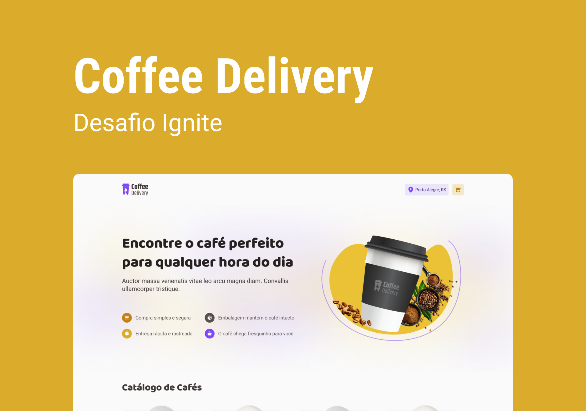

<h1 align="center"> Desafio 02 - Coffee Delivery </h1>

  <a href="#-tecnologias">Tecnologias</a>&nbsp;&nbsp;&nbsp;|&nbsp;&nbsp;&nbsp;
  <a href="#-projeto">Projeto</a>&nbsp;&nbsp;&nbsp;|&nbsp;&nbsp;&nbsp;
  <a href="#memo-licença">Licença</a>

  Aplicativo para gerenciar um carrinho de compras de uma cafeteria, <a target="_blank" href="https://coffee-delivery-natan3001.vercel.app/">clique aqui para acessar</a>

  

 

  

## 🚀 Tecnologias

Esse projeto foi desenvolvido com as seguintes tecnologias:

- HTML e CSS
- Typescript
- Vite
- React
- Styled Components
- React Router Dom
- React Hook Form
- React Toastify
- Phosphor Icons
- Zod

## 💻 Projeto

Aplicativo para gerenciar um carrinho de compras de uma cafeteria fictícia, que contém as seguintes funcionalidades:

- Listagem de produtos (cafés) disponíveis para compra
- Adicionar uma quantidade específicas de itens no carrinho
- Aumentar ou remover a quantidade de itens no carrinho
- Formulário para o usuário preencher o seu endereço
- Exibir o total de itens no carrinho no Header
- Exibir o valor total da soma de itens no carrinho multiplicados pelo valor

Apesar de serem poucas funcionalidades, foram usados conceitos como:

- Estados
- ContextAPI
- LocalStorage
- Imutabilidade do estado
- Listas e chaves no ReactJS
- Propriedades
- Componentização

## :memo: Licença

Esse projeto está sob a licença MIT.

---

Feito com ♥ by Natan Martins dos Santos :wave:
